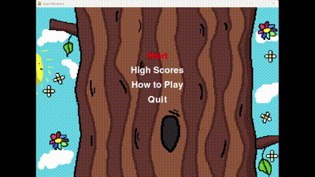

## Overview
This game is designed using Python, leveraging several libraries to create an engaging and interactive experience. The main libraries used are `pygame` for game development and `pydantic` for data validation. This README file will cover the structure of the game, the functionality of important modules, installation, how to run the game, references, and how everything integrates to create the final product.

## Introduction
Welcome to **Jump Adventure**, an exciting and fast-paced platformer game where you navigate through challenging levels filled with moving platforms, dangerous enemies, and helpful boost items. **Jump Adventure** tests your reflexes and strategic thinking as you jump, shoot, and dodge your way to the highest score. Inspired by the classic game **Doodle Jump** 

This game was created by **Ahmed Noureldin**, **Burak Kağan Yılmazer**, and **Robert Richartz**. All artwork used in the game was uniquely produced by **Leonhard** and **Robert Richartz**, ensuring a distinctive visual experience.

With dynamically increasing difficulty, a variety of enemy types, and unique platform behaviors, **Jump Adventure** offers endless fun and replayability. Are you ready to take on the adventure and reach new heights?

  

## Table of Contents
1. [Game Structure](#game-structure)
2. [Game Instructions](#game-instructions)
3. [Important Modules and Functions](#important-modules-and-functions)
4. [Installation](#installation)
5. [How to Run the Game](#how-to-run-the-game)
6. [References](#references)
7. [PyTest and CI](#pytest-and-ci)
8. [License](#license)

## Game Structure
The game is structured into several Python modules, each handling different aspects of the game:

- `main.py`: The entry point of the game.
- `menu.py`: Handles the game menu.
- `player.py`: Manages player attributes and actions.
- `enemies.py`: Defines enemy behaviors and characteristics.
- `enemy_manager.py`: Manages multiple enemies within the game.
- `game_platform.py`: Manages the game platforms and their behaviors.
- `platform_manager.py`: Handles the creation and management of platforms.
- `boost_items.py`: Defines and manages the boost items available in the game.
- `boosts.py`: Implements the functionalities of various boost items.
- `background.py`: Manages the background elements of the game.
- `projectile.py`: Defines the properties and behaviors of projectiles.
- `projectile_manager.py`: Manages multiple projectiles within the game.
- `test.py`: Contains test cases to ensure the game's functionality.
- `requirements.txt`: Lists the dependencies required for the game.
- `high_scores.txt`: Records the high scores achieved in the game.
- `instructions.txt`: Provides instructions on how to play the game.

## Game Instructions
Instructions on how to play the game are provided in the instructions.txt file. Here are the key points:

- Movement:
    - LEFT: Move left
    - RIGHT: Move right
    - UP: Shoot
    -  SPACE: Jump
    - Q: Quit the game
- Game Objectives:
    - Avoid enemies and stay on platforms as difficulty increases.
    - Collect boost items for extra points.
    - Tip: You can go through sides of the screen and come out the other side.
- Platform Types:
    - Normal Platform: Static platforms to stand on.
    - Moving Platform: Platforms that move horizontally.
    - Falling Platform: Platforms that fall rapidly.
    - Disappearing Platform: Platforms that disappear when jumped from.
- Enemy Types:
    - Basic Enemy: Moves in a straight line.
    - Bouncing Enemy: Moves in a bouncing pattern.
    - Chasing Enemy: Follows the player.
    - Tip: You can kill the enemies by jumping on them.
- Boost Items:
    - Parachute: Slows down your fall.
    - Double Jump: Allows you to jump again while in the air.
    - Shield: Protects you from enemies.
    - Note: Active power-ups visible on the buttom left of the screen.
        - Shield is active for 10 seconds after picking it up.
        - Parachute is active for 5 seconds after picking it up.
        - Double Jump is active for 5 seconds after picking it up or until you use it. 

## Important Modules and Functions

### 1. `main.py`
This is the entry point of the game. It initializes the game, sets up the main game loop, and handles events.

Key Functions:
- `initialize_game()`: Sets up the game window and initializes pygame.
- `game_loop()`: Contains the main game loop, handles events, updates game state, and renders the game.
- `event_handler(menu_active, game_over)`: Handles user input events.
- `render_text(text, font, color, surface, x, y)`: Creates and renders text on the screen.
- `check_and_save_high_score(score, menu)`: Checks and saves the high score.
- `render_game_images(window)`: Renders all game images, including player, platforms, enemies, boost items, and projectiles.
- `init_new_game(menu_status)`: Resets or starts the game.
- `increase_level()`: Increases the game level dynamically.

### 2. `menu.py`
Manages the game menu interface, including navigation and selection of different options.

Key Functions:
- `draw()`: Displays the main menu and handles background.
- `handle_input(event)`: Handles user inputs in the menu.
- `select_option()`: Processes the selected menu option.
- `show_high_scores()`: Displays the high scores.
- `show_how_to_play()`: Shows instructions on how to play the game.
- `load_high_scores()`: Loads high scores from a file.
- `save_high_score(score)`: Saves a new high score to a file.

### 3. `player.py`
Defines the player character, including attributes like position, health, and actions such as movement and collision detection.

Key Functions:
- `draw_self(window)`: Draws the player on the screen.
- `get_rect()`: Returns the rectangle representing the player's position.
- `jump()`: Makes the player jump.
- `shoot()`: Allows the player to shoot projectiles.
- `check_grounded()`: Checks if the player is grounded and applies gravity.
- `check_height()`: Ensures the player doesn't exceed certain height limits.
- `check_jump()`: Verifies if the player can jump.
- `wrap_around(screen_width)`: Implements wrap-around logic for the player.
- `manage_player_attack(window, enemy_manager)`: Manages the shooting mechanics.
- `check_boosts()`: Checks the status of active boosts.
- `check_out_of_bounds(window)`: Checks if the player is out of the screen bounds.
- `update(window, enemy_manager)`: Updates the player's state.
- `handle_player_platforms(platform_manager, screen)`: Handles player-platform interactions.
- `enemy_collision(enemy_manager)`: Manages player-enemy collisions.
- `collect_parachute()`, `collect_shield()`, `collect_double_jump()`: Handle boost collection.

### 4. `enemies.py`
Defines enemy types and their behaviors.

Key Classes:
- `Base_Enemy`: A base class for all enemy types, containing methods for movement and attack.
- `Bouncing_Enemy`: A subclass of `Base_Enemy` that moves in a bouncing pattern.
- `Chasing_Enemy`: A subclass of `Base_Enemy` that follows the player.

### 5. `enemy_manager.py`
Manages the creation, updating, and removal of enemies in the game.

Key Functions:
- `spawn_enemy(screen)`: Creates a new enemy at a specified location.
- `render_enemies(screen)`: Renders all enemies on the screen.
- `manage_enemies(screen)`: Manages enemy spawning, movement, and handling logic.
- `increment_difficulty(level)`: Increases the difficulty of the game by adjusting enemy spawn rates.

### 6. `game_platform.py`
Defines the game platforms that the player interacts with.

Key Classes:
- `Platform`: A class representing a single platform in the game.
- `Horizontal_Platform`: A subclass of `Platform` that moves horizontally.
- `Falling_Platform`: A subclass of `Platform` that falls faster.
- `Disappearing_Platform`: A subclass of `Platform` that disappears after being touched.

### 7. `platform_manager.py`
Manages multiple platforms within the game, including their creation and updating.

Key Functions:
- `spawn_platform(screen_width, colors)`: Generates a new platform.
- `render_platforms(window)`: Renders all platforms on the screen.
- `manage_platforms(window, colors)`: Manages platform spawning, movement, and rendering.
- `increment_difficulty(level)`: Increases the difficulty of the game by adjusting platform spawn rates and speeds.

### 8. `boost_items.py`
Defines and manages the boost items available in the game.

Key Classes:
- `BoostItem`: A base class for all boost items.
- `HealthBoost`: A subclass that increases the player's health.
- `SpeedBoost`: A subclass that increases the player's speed.

### 9. `boosts.py`
Implements the functionalities of various boost items.

Key Functions:
- `apply_boost()`: Applies the effect of a boost item to the player.

### 10. `background.py`
Manages the background elements of the game.

Key Functions:
- `draw_background()`: Renders the background elements on the screen.

### 11. `projectile.py`
Defines the properties and behaviors of projectiles.

Key Classes:
- `Projectile`: A class representing a single projectile in the game.

### 12. `projectile_manager.py`
Manages multiple projectiles within the game, including their creation and updating.

Key Functions:
- `create_projectile()`: Generates a new projectile.
- `update_projectiles()`: Updates the state of all projectiles.

### 13. `test.py`
Contains test cases to ensure the game's functionality.

Key Functions:
- `test_player_movement()`: Tests the player's movement functionality.
- `test_enemy_spawn()`: Tests the enemy spawning functionality.

## Installation
To install the game, ensure you have Python installed on your system. Then, install the required dependencies using the `requirements.txt` file:

`pip install -r requirements.txt`

## How to Run the Game
Once the dependencies are installed, you can run the game by executing the main.py file:

`python main.py`

## References
The game utilizes several Python libraries and follows best practices in game development. Here are some references that were used during the development:

- Pygame Documentation: https://www.pygame.org/docs/
- Pydantic Documentation: https://pydantic-docs.helpmanual.io/
- Python Documentation: https://docs.python.org/3/
- Music Credit:
    -  Royalty Free Music: Mixkit
    - Royalty Free Music: Bensound
- Code Inspirations:
    - "How to Make Doodle Jump in Python using PyGame! Infinite Jumping Game full game creation tutorial!" by LeMaster Tech, Youtube: https://www.youtube.com/watch?v=qmcgrk5KfHQ&t=2043s&ab_channel=LeMasterTech
    - "How to Add Sound Effects to your Python Game" by Michael Maranan, The Python Code: https://thepythoncode.com/article/add-sound-effects-to-python-game-with-pygame
    -  "Work with text" by Raphael Holzer, Pygame Documentation: https://pygame.readthedocs.io/en/latest/4_text/text.html
    - "Pygame Menu Tutorial – Complete Guide" by Zenva, Game Dev Academy: https://gamedevacademy.org/pygame-menu-tutorial-complete-guide/
    - "Making a scrollbar but its inconsistent" by Rabbid76, Stack Overflow: https://stackoverflow.com/questions/66369695/making-a-scrollbar-but-its-inconsistent
    - "How to read, write and update of your game highscore in pygame from/to file.txt saved.?" by Mike67, Stack Overflow: https://stackoverflow.com/questions/63751107/how-to-read-write-and-update-of-your-game-highscore-in-pygame-from-to-file-txt
    - "Wrap Around Movement - PyGame Thursdays 29" by codemy.com: https://youtu.be/NzCulpYC0p8?si=pC2ub_RixVEi9ekQ
    - "How to make an enemy follow the player in pygame" by Stack Overflow: https://stackoverflow.com/questions/20044791/how-to-make-an-enemy-follow-the-player-in-pygame
    - GitHub Repositories: Referenced for certain coding patterns and solutions.

## PyTest and CI
Tests for the Game have been implemented in the `test.py` file. Because they are Testing the actual happenings within the game and need to render certain objects, running these test requires running the command line code: `pytest -p no:warnings test.py`

CI has been integrated, due to the complex nature of the PyGame Frame, placeholder Assertions are being used, referencing the `ci-test.py` file. The Are acting as a placeholder for now, to allow for a proper Setup of CI. These are subject to change, should the project be continued. 

The `main.yml` was created with the assistance of LLM Tools. 

## License
This project is licensed under the MIT License - see the [LICENSE](LICENSE) file for details.